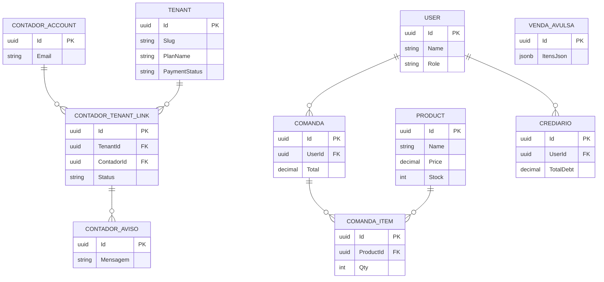

# 📖 Tenant-ERP (Plataforma 3esysten) — O Guia Definitivo de Arquitetura e Engenharia

> **Documento elaborado para *Onboarding* de Novos Desenvolvedores, Arquitetos e Tech Leads.**
> Esta documentação é o mapa completo do sistema, cobrindo requisitos, infraestrutura, fluxos de dados, arquitetura lógica de código e dívidas técnicas da versão atual (SaaS Multi-tenant v4.0).

---

## 1. Levantamento de Requisitos (Visão de Produto)

O Tenant-ERP nasceu como um sistema local para uma loja de TCG (Santuário Nerd) e evoluiu para uma **Plataforma SaaS Multi-tenant** (3esysten) que atende dezenas de lojas simultaneamente, garantindo isolamento total de dados e regras de negócio.

### Requisitos Funcionais (RFs)
- **RF01 - Multi-tenancy:** O sistema deve suportar múltiplas lojas, cada uma com seus próprios produtos, clientes e configurações, sem vazamento de dados.
- **RF02 - Frente de Caixa (PDV):** Deve permitir a venda rápida no balcão (Venda Avulsa), aceitando múltiplos métodos de pagamento e descontando o estoque na hora, com geração de cupom não-fiscal (80mm e PDF).
- **RF03 - Comanda via QR Code:** Clientes devem abrir comandas lendo um QR Code na mesa, autenticando via CPF/WhatsApp (sem necessidade de baixar app), e o pedido deve refletir em tempo real na tela do administrador.
- **RF04 - Gestão de Crediário:** Vendas a prazo devem gerar saldos devedores (crediários), permitindo quitações parciais ou totais.
- **RF05 - Assistente de IA:** O lojista deve ter acesso a um chat via IA (Google Gemini) que conhece o contexto da loja (estoque, devedores) para auxiliar em decisões.
- **RF06 - Portal do Contador:** Contadores devem poder gerenciar múltiplas lojas (tenants) sob a mesma conta, visualizar resumos financeiros e alertas fiscais (DAS) de clientes vinculados.
- **RF07 - Conformidade LGPD:** O titular dos dados (cliente final) deve poder consultar e solicitar anonimização/deleção de seus dados através de um portal público.
- **RF08 - Programa de Fidelidade (opcional):** Cada loja decide, em Personalizar Site, se tem programa de pontos — desligar não apaga saldo/histórico existente, só para novos ganhos/resgates.

### Requisitos Não Funcionais (RNFs)
- **RNF01 - Segurança e JWT:** A autenticação deve usar JWT envelopado em Cookies `HttpOnly` com `SameSite=Lax`, prevenindo ataques XSS e mitigando CSRF.
- **RNF02 - Desempenho e Tempo Real:** A tela de comandas do lojista não pode exigir F5. Atualizações (novos pedidos, fechamentos) devem usar WebSockets (SignalR).
- **RNF03 - Isolamento de Banco de Dados:** Não deve existir o risco de um *WHERE* esquecido expor dados do Tenant A para o Tenant B (resolvido via schema físico).
- **RNF04 - Infraestrutura Econômica:** Deve rodar de forma conteinerizada (Docker) em uma VPS enxuta, com proxy reverso leve.

---

## 2. Stack Tecnológica (A Escolha das Ferramentas)

| Camada | Tecnologia | Motivo da Escolha |
|---|---|---|
| **Backend API** | ASP.NET Core 8 (C#) | Tipagem estática forte, altíssima performance, rico ecossistema (EF Core) e excelente integração com SignalR. |
| **Banco de Dados** | PostgreSQL 16 | ACID compliant, suporta queries geoespaciais, colunas `JSONB` de alta performance e permite isolamento por `search_path` (schemas dinâmicos). O MongoDB foi descartado para reduzir custo de infraestrutura. |
| **Frontend** | Next.js 14 (App Router) | SSR (Server-Side Rendering) para telas públicas (SEO) e rotas dinâmicas robustas para SPA no painel admin. |
| **Estilização** | Tailwind CSS 3 | Padronização de design tokens e criação rápida de componentes sem fricção de CSS global. |
| **Tempo Real** | SignalR | Abstrai WebSockets e faz fallback gracefully para Long Polling. |
| **Infra/Deploy** | Docker Compose + Nginx | Orquestração declarativa que permite deploy com um único comando na VPS. O Nginx atua como proxy reverso roteando domínios/subdomínios. |

---

## 3. Arquitetura e Diagrama ASCII

O sistema foi desenhado para escalabilidade horizontal no Frontend e vertical no Banco de Dados (inicialmente). O fluxo de rede passa pelo DNS da Cloudflare, que resolve o subdomínio e bate na porta 80 do Nginx na VPS.

### Diagrama ASCII da Topologia de Rede e Software

```text
       [ Cliente (Navegador/Celular) ]
                     |
        (HTTPS - TLS Terminado pela Cloudflare)
                     |
[ Cloudflare (DNS *.3esysten.com.br / santuarionerd.tech) ]
                     |
                     V
         [ VPS Ubuntu 24.04 (Hostinger) ]
         +------------------------------------------------+
         |                 [ NGINX ]                      |
         |         (Proxy Reverso - Porta 80)             |
         |         /                        \             |
         |  Se requisição for          Se requisição for  |
         |  /api/* ou /hub/*           página web normal  |
         |       /                            \           |
         |      V                              V          |
         | [ Backend: CardGameStore ]     [ Frontend: Next.js ]
         | (ASP.NET Core 8 - :5000)       (Node.js - :3000)   |
         |   - JWT / Auth                   - React / SSR     |
         |   - SignalR Hubs                 - Tailwind        |
         |   - EF Core Interceptors         - Axios           |
         |          |                                         |
         +----------|-----------------------------------------+
                    |
                    V
         [ Banco de Dados: PostgreSQL 16 ]
         +------------------------------------------------+
         | Schema 'public': Tenant, ContadorAccount       |
         | Schema 'tenant_nerd': User, Product, Comanda   |
         | Schema 'tenant_foo': User, Product, Comanda    |
         +------------------------------------------------+
```

---

## 4. Estrutura do Projeto (Dicionário de Pastas)

Saber onde as coisas moram é 50% do trabalho no onboarding.

### Backend (`Tenant-ERP/CardGameStore/`)
- `Controllers/`: Camada de borda da API. Onde as requisições HTTP chegam e as respostas HTTP saem. Nenhuma regra de negócio densa deveria morar aqui, mas sim orquestração.
- `Multitenancy/`: **O coração arquitetural.** Contém o `TenantConnectionInterceptor` (que injeta o schema dinâmico no Postgres), o `TenantResolutionMiddleware` (que lê o subdomínio), e entidades globais como `Tenant.cs` e `CatalogDbContext.cs`.
- `Services/`: Onde mora a lógica pesada. Interfaces e Implementações (ex: `IComandaService`, `GeminiChatService`).
- `Models/PostgreSQL/`: As entidades do Entity Framework Core que mapeiam para o banco de dados das lojas (Comanda, Produto, Usuário, etc.).
- `DTOs/`: Data Transfer Objects. Modelos anêmicos usados APENAS para receber JSON do frontend e devolver JSON. Blindam as entidades reais.
- `Hubs/`: `ComandaHub.cs`. O ponto de entrada dos WebSockets do SignalR.
- `Validation/`: Validadores customizados como `CpfValidAttribute.cs` (Módulo 11).
- `Data/`: Configuração do `AppDbContext.cs` e histórico de `Migrations`.

### Frontend (`Tenant-ERP/frontend/`)
- `app/`: A estrutura de roteamento do Next.js (App Router).
  - `admin/`: Painel do lojista (estoque, relatórios, caixas).
  - `plataforma/`: Painel do Dono do SaaS (listar tenants, assinaturas).
  - `contador/`: Portal do contador cross-tenant.
  - `institucional/`: A Landing Page de vendas do ERP.
  - `mesa/[mesa]/`: Visão do cliente escaneando o QR Code na mesa.
- `components/`: Componentes React reutilizáveis (Sidebar, Modal, AiChatWidget, DataTable).
- `lib/`: Códigos utilitários (instância do `api.ts` com Axios interceptors, conexão SignalR).
- `contexts/`: React Contexts (ex: `SiteConfigContext` que carrega as cores do tenant).

---

## 5. Mapeamento de Rotas e URLs

### Frontend URLs Principais
- `https://{slug}.3esysten.com.br/` -> Home da Loja (Landing page do tenant).
- `https://{slug}.3esysten.com.br/admin` -> Painel do Lojista.
- `https://{slug}.3esysten.com.br/mesa/01` -> Abertura de comanda via QR Code.
- `https://3esysten.com.br/institucional` -> Site de vendas do SaaS.
- `https://3esysten.com.br/plataforma` -> Super-Admin (Host).
- `https://3esysten.com.br/contador` -> Portal Cross-Tenant.

### API Endpoints Vitais (Prefixo `/api`)
- `POST /auth/quick-login`: Rota de fricção zero. Recebe CPF e WhatsApp do cliente na mesa, cria/recupera o usuário e abre uma comanda instantaneamente, injetando cookies de Auth.
- `POST /auth/login`: Login clássico para administradores (loja, plataforma e contador).
- `POST /comanda/{id}/items`: Adiciona item na comanda e emite evento SignalR para a tela do admin.
- `PUT /comanda/{id}/close`: Realiza o checkout da comanda, abatendo pontos fidelidade, gerando `Crediario` se necessário e limpando a mesa.
- `POST /platform/tenants`: Disparado pelo Dono. Cria um novo schema no banco e popula com a seed inicial do tenant.

---

## 6. Deep Dive: Controllers e DTOs (O Coração do Backend)

### O Paradigma dos DTOs (Data Transfer Objects)
No Tenant-ERP, **nenhuma entidade de banco (Model) é trafegada via JSON diretamente**.
- **O Problema evitado:** Evita *Over-posting* (hacker injetando `isAdmin=true` no JSON) e quebra de serialização devido a referências circulares (`Comanda -> User -> Comandas`).
- **O Padrão:** Todo Controller recebe um `{Entidade}RequestDto` e retorna um `{Entidade}ResponseDto`. O mapeamento é feito nos Controllers ou Services.

### Anatomia dos Controllers Essenciais
1. **`AuthController`:** 
   - Responsável por validar credenciais contra o hash do BCrypt.
   - **Detalhe Crítico:** Não retorna o Token JWT no *body* do JSON. Ele anexa o JWT no cabeçalho HTTP de resposta como um `Set-Cookie: accessToken=...; HttpOnly; SameSite=Lax`. O Frontend (Javascript) não consegue ler o token, blindando contra ataques XSS.
2. **`ComandaController`:**
   - Possui injeção do `IHubContext<ComandaHub>`. Sempre que uma ação muta uma comanda (abre, fecha, adiciona item), o Controller grita para o Hub: `await _hub.Clients.Group(tenantSlug).SendAsync("ComandaUpdated", ...)`.
3. **`PlatformController`:**
   - Controlado pelo *Gate* `[Authorize(Roles = "PlatformOwner")]`.
   - Gerencia a tabela global de `Tenant`. É o maestro do provisionamento.
4. **`AiChatController`:**
   - Recebe as mensagens do frontend e constrói um "System Prompt" massivo. Ele puxa relatórios rápidos do banco ("Tenho X produtos acabando, a comanda 123 está aberta") e envia tudo pro LLM, servindo de cérebro estendido do admin.

---

## 7. Explicações de Fluxo Passo-a-Passo

### 🪄 Fluxo 1: A Mágica do Multi-tenant (Como o isolamento ocorre)
1. Cliente acessa `nerd.3esysten.com.br/api/product`.
2. O **`TenantResolutionMiddleware`** entra em ação. Extrai "nerd" do cabeçalho `Host`.
3. Busca no `CatalogDbContext` (schema `public`) o Tenant com slug "nerd". Acha o `TenantId = 'uuid-123'`.
4. Armazena a informação no `ITenantContext` (Scoped por requisição HTTP).
5. O Controller do Produto chama `_dbContext.Products.ToList()`.
6. O EF Core abre a conexão. O **`TenantConnectionInterceptor`** intercepta essa abertura.
7. O interceptor lê o `ITenantContext`. Executa um comando cru: `SET search_path TO "tenant_uuid-123"`.
8. O banco retorna apenas os produtos do lojista "nerd". Isolamento absoluto sem espalhar `Where(p => p.TenantId == ...)` pelo código.

### 💳 Fluxo 2: Abrindo e Fechando uma Comanda QR Code
1. Cliente senta na mesa e escaneia o QR Code. O browser abre `/mesa/05`.
2. O Next.js pede CPF. Ao enviar, dispara `POST /api/auth/quick-login`.
3. Backend cria ou acha o cliente. Cria uma `Comanda` atrelada à Mesa 5. Retorna cookies.
4. O Admin, na aba `/admin/dashboard`, está escutando o SignalR. Ele recebe o evento `ComandaOpened` e a mesa do cliente pisca na tela dele.
5. Cliente pede Coca-Cola (`POST /api/comanda/xxx/items`).
6. Ao sair, o Admin aperta "Fechar Comanda". O sistema verifica os pontos de fidelidade. Cliente paga via PIX. A `Comanda` muda para Status `Closed` e a mesa é liberada.

---

## 8. Bancos de Dados, Schemas e DER

O sistema é suportado exclusivamente pelo **PostgreSQL 16**. O MongoDB foi removido (Débito técnico quitado) para simplificar backup, joins lógicos (histórico de venda avulsa vs produtos) e custos de RAM no VPS.

- **Venda Avulsa (Por que JSONB?):** Uma Venda no balcão é um cupom. Se eu deleto o Produto X, a venda de ontem não pode quebrar. Em vez de criar infinitas tabelas de associação temporais, a `VendaAvulsa` possui uma coluna `ItensJson` de tipo genuníno `JSONB`. O Snapshot (Nome, Preço na época, Quantidade) é imutável.

### Diagrama Entidade-Relacionamento (DER Mermaid)



---

## 9. Segurança, LGPD e Anonimização

- **Módulo 11 (CPF):** Todo CPF é validado matematicamente pela Receita Federal (`CpfValidAttribute`), impossibilitando CPFs falsos (como 111.111.111-11) entrarem no CRM.
- **Audit Logs e IPs (LGPD):** Registros críticos salvam o IP do ator. Mas, para cumprir a LGPD, usamos **Anonimização via SHA-256**. O IP `192.168.0.1` + `SALT` vira um hash. Não sabemos de quem é o IP, mas se um ataque vier da mesma fonte, os hashes baterão para bloqueio.
- **Direitos do Titular:** Endpoint e painel que permitem extrair (portabilidade) e mascarar os dados pessoais de clientes que exercerem o direito ao esquecimento, mantendo a integridade fiscal (comandas fechadas não são apagadas, apenas o nome vira "Usuário Deletado").

---

## 10. Análise Crítica (Escalabilidade, Otimizações e Débitos Técnicos)

Como em toda plataforma viva, existem decisões brilhantes e compromissos assumidos.

### 🌟 O que deu muito certo (Arquitetura Ouro)
1. **Isolamento por Schema:** Permite ter 5 ou 500 tenants no mesmo banco sem medo de bugs lógicos vazarem dados.
2. **Abordagem de Cookies HttpOnly:** Mitigou a maior fraqueza de SPAs modernas (Tokens JWT em localStorage sendo roubados por extensões Chrome).
3. **Remoção do MongoDB:** Cortou o custo da fatura da Cloud pela metade e permitiu usar os superpoderes do JSONB do Postgres.

### 📈 Otimizações Planejadas e Escalabilidade
- **Gargalo no Entity Framework:** Conforme lojas emitirem 10.000 comandas/mês, o painel financeiro (`AnalyticsController`) vai sofrer lentidão se continuar mapeando os objetos (Tracking). **Mandatório usar `.AsNoTracking()`** nessas rotas de leitura maciça para evitar estourar a RAM do ASP.NET.
- **Cache de Configurações (Redis):** A tabela genérica `SiteConfig` é lida a cada load. Quando escalarmos, o Postgres vai fritar para ler a cor do botão da loja. Um cache L1 ou Redis será necessário para desafogar o banco.

### ⚠️ Débitos Técnicos (Atenção Dev!)
1. **A Bomba-Relógio do Gemini (IA):** Existe apenas 1 API Key Global. Um lojista estressando o chat estourará o limite gratuito da API do Google, derrubando a funcionalidade para TODAS as outras dezenas de lojas. Solução urgente: Rate Limit no `AiChatController` *segmentado por tenant_id*.
2. **Gateway de Pagamento do SaaS:** Hoje o Super-admin precisa "suspender" na mão a loja que não pagou a mensalidade do Tenant-ERP em `/plataforma`. A integração com Asaas/Stripe via Webhook é a prioridade 1 para automatizar o faturamento B2B.
3. **Retrabalho mobile das telas operacionais:** Comanda e Estoque hoje só são responsivas (mesma UI espremida), não desenhadas pra celular — quem opera em pé no balcão sente. Planejado, ainda não iniciado.

---
*Gerado por Engenharia de Software Core - Versão V4.0.*
