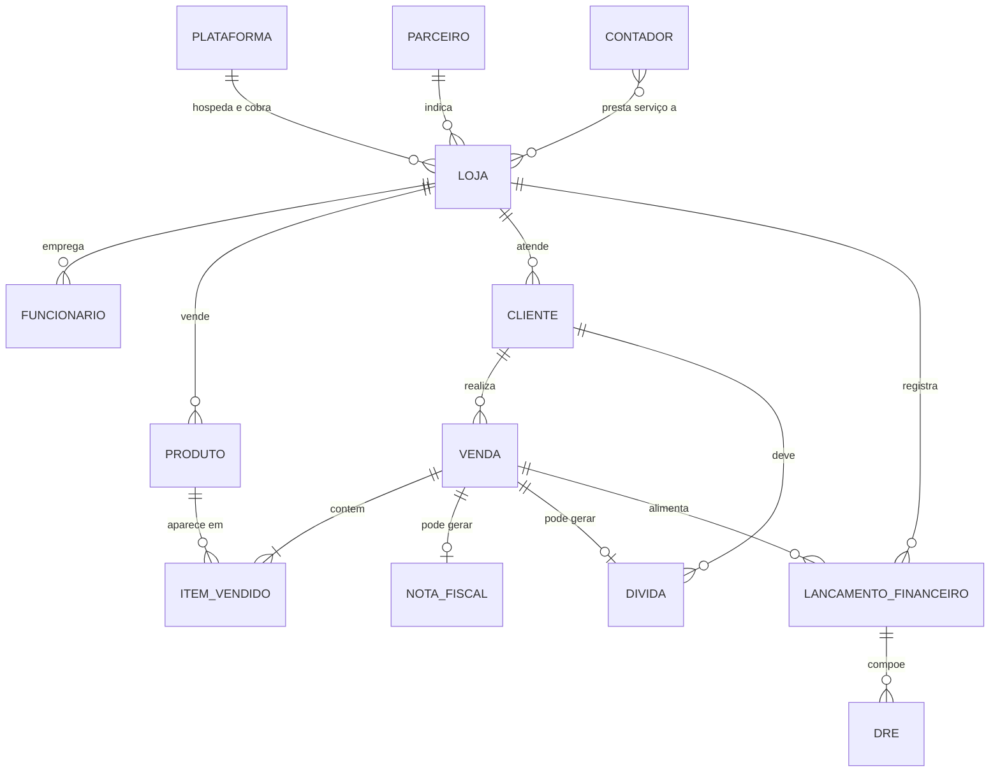
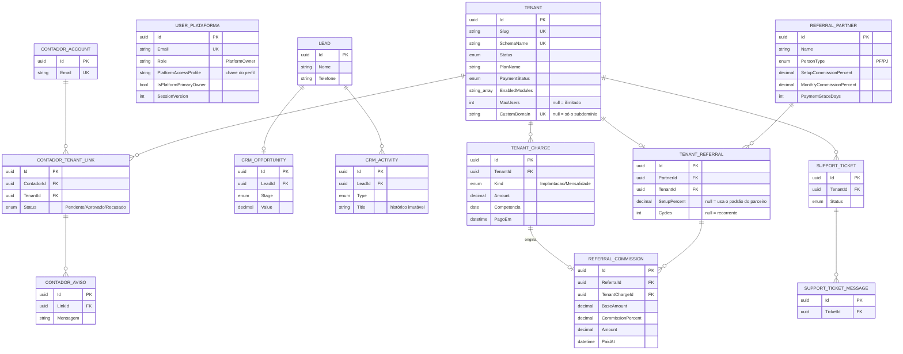
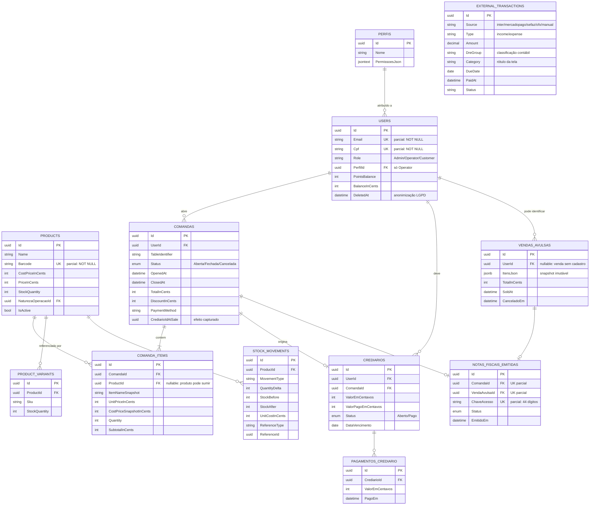
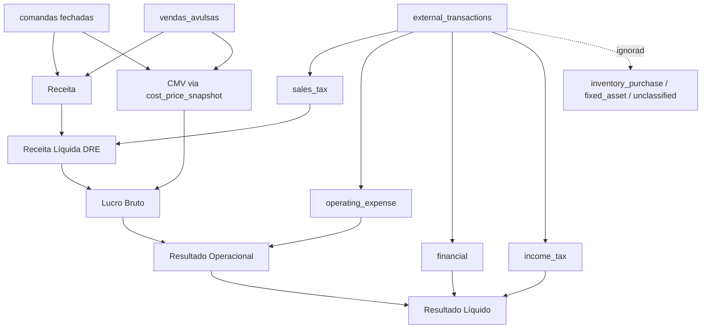

# Modelagem de Dados — Tenant-ERP (Octus)

Modelo conceitual, lógico e físico do banco, mais a modelagem dos relatórios que
saem dele (DRE, fechamento de período, razão de estoque).

O DER resumido de `DOCUMENTACAO-COMPLETA.md` (seção 8) continua sendo o mapa de
bolso — este documento é o detalhamento por trás dele.

---

## Como ler este documento

Três níveis, do mais abstrato ao que está de fato no PostgreSQL:

| Nível | Responde | Onde olhar no código |
|---|---|---|
| **Conceitual** | Que coisas existem no negócio e como se relacionam | — |
| **Lógico** | Que entidades, chaves e cardinalidades sustentam isso | `Models/PostgreSQL/*.cs`, `Multitenancy/*.cs` |
| **Físico** | Tabelas, tipos, índices e restrições reais | `Data/AppDbContext.cs`, `Multitenancy/CatalogDbContext.cs`, `Data/Migrations/` |

---

## 1. A decisão que molda tudo: dois bancos lógicos, um servidor

O PostgreSQL é único, mas há **duas populações de dados que nunca se cruzam por
join**:

```
PostgreSQL 16 (uma instância)
│
├── schema "public"  ─────────── CatalogDbContext
│   O negócio DA PLATAFORMA: quem são as lojas, quanto pagam, de onde vieram,
│   quem indicou, quem dá suporte. Ninguém dentro de uma loja enxerga isto.
│
└── schema "<slug>"  ─────────── AppDbContext   (um schema por loja)
    O negócio DE UMA loja: produtos, comandas, clientes, notas fiscais.
    Estrutura idêntica em todos, dados isolados por `search_path`.
```

O isolamento **não** é uma coluna `tenant_id` filtrada em toda query — é o
`search_path` da conexão, aplicado pelo `TenantConnectionInterceptor`. A
diferença importa: com `tenant_id`, um `WHERE` esquecido vaza dado de outra loja
e o código continua compilando. Com schema, a tabela do outro tenant simplesmente
não está no caminho de resolução de nomes — o vazamento vira erro de "relação não
existe", não resultado silencioso.

O preço está pago em outro lugar: migration roda uma vez por schema (ver C4 na
auditoria de escalonamento), e não existe consulta agregando todas as lojas sem
percorrer schema a schema. `PlatformController.RunInTenantScopeAsync` é quem faz
essa travessia quando o painel da plataforma precisa.

**Tenant-zero:** o schema `public` também hospeda os `users` de papel
`PlatformOwner` e as contas `Contador`. São contas cross-tenant: existem fora de
qualquer loja e por isso não podem morar no schema de nenhuma.

---

## 2. Modelo conceitual

O que o negócio tem, sem falar em tabela.



Duas leituras que valem a pena:

- **VENDA é um conceito com duas formas físicas.** No balcão vira `VendaAvulsa`
  (um cupom fechado de uma vez); na mesa vira `Comanda` (aberta, itens somados ao
  longo do tempo, fechada depois). Os relatórios tratam as duas como venda; o
  banco não as unifica, porque o ciclo de vida é diferente.
- **DIVIDA (crediário) nasce do fechamento**, não da venda em si — é uma forma de
  pagamento, não um tipo de venda.

---

## 3. Modelo lógico — schema `public` (catálogo da plataforma)



**A cadeia que fecha o dinheiro da plataforma:**
`TENANT_CHARGE` (o que a loja deve) → baixa no financeiro → gera
`REFERRAL_COMMISSION` (o que o parceiro ganha). A comissão referencia a cobrança
que a originou, e não o mês em abstrato: sem esse `TenantChargeId`, uma cobrança
reaberta e paga de novo produziria uma segunda comissão sobre o mesmo dinheiro.

**`ReferralPartner` guarda percentuais próprios e `TenantReferral` pode
sobrescrevê-los.** É negociação por cliente: o parceiro tem um padrão, mas um
cliente específico pode ter sido fechado com outra régua. `Cycles` nulo significa
comissão recorrente enquanto o cliente pagar.

---

## 4. Modelo lógico — schema do tenant (a loja)

São 42 tabelas. Agrupadas por assunto:

| Grupo | Tabelas |
|---|---|
| **Pessoas e acesso** | `users`, `perfis` |
| **Catálogo** | `products`, `product_categories`, `product_variants`, `product_waitlist`, `product_reservations` |
| **Venda** | `comandas`, `comanda_items`, `vendas_avulsas`, `pix_cobrancas` |
| **Crédito** | `crediarios`, `pagamentos_crediario` |
| **Fiscal** | `fiscal_config`, `naturezas_operacao`, `notas_fiscais_emitidas`, `inutilizacoes_fiscais`, `alertas_fiscais`, `ibpt_tabela`, `fechamentos_fiscais_mensais`, `sefaz_distribution_state` |
| **Entrada de mercadoria** | `notas_destinadas`, `nfe_receipt_items`, `supplier_product_links`, `stock_movements` |
| **Financeiro** | `external_transactions`, `fechamentos_periodo` |
| **Restaurante** | `restaurant_production_areas` |
| **Eventos** | `eventos`, `evento_entradas` |
| **Comunicação** | `announcements`, `notifications`, `push_subscriptions`, `timers` |
| **Configuração** | `site_config`, `email_config`, `ai_config`, `integration_configs` |
| **Compliance** | `audit_logs`, `lgpd_requests`, `cookie_consents`, `kyc_verifications` |
| **Analytics** | `page_view_events` |

### Núcleo transacional



---

## 5. Modelo físico — as convenções

Cinco regras atravessam o schema inteiro. Entender elas dispensa ler tabela por
tabela.

### 5.1 Dinheiro é `integer` em centavos, não `decimal`

`price_in_cents`, `total_in_cents`, `valor_em_centavos`. A conversão para reais é
sempre `/ 100m`, na borda.

Motivo: soma de `decimal` em ponto flutuante acumula erro, e o total de uma
comanda é conferido no olho contra a maquininha. Centavo inteiro não tem
arredondamento a discutir.

A exceção é `external_transactions.amount`, que é `numeric(10,2)`: ali o valor
vem de extrato bancário e de NF-e de fornecedor, já em reais, e converter na
entrada só criaria um ponto a mais para errar.

> **Cuidado ao somar:** os totais são `int`, e `SUM` sobre milhares de linhas
> estoura. As queries fazem cast para `bigint` antes (`(long)i.UnitPriceInCents *
> i.Quantity`). Isso não é estilo — sem o cast o relatório financeiro dá overflow
> silencioso na loja que vender bem.

### 5.2 Snapshot em vez de join histórico

`comanda_items` guarda `item_name_snapshot`, `unit_price_in_cents` e
`cost_price_snapshot_in_cents`. `vendas_avulsas` guarda a venda inteira em
`itens_json` (`jsonb`).

Motivo: o cupom de ontem não pode mudar porque alguém corrigiu o preço hoje.

O histórico é protegido por dois lados. `comanda_items.product_id` é **nullable**
(existe item sem produto de catálogo) e a FK é `ON DELETE RESTRICT`: o banco
recusa apagar um produto que já foi vendido. É por isso que o catálogo trabalha
com `is_active` em vez de exclusão — desativar tira o produto da venda sem tocar
no que já saiu. Do outro lado, o snapshot garante que mesmo que o produto sumisse,
o cupom continuaria legível sozinho.

Já `comanda_items → comandas` é `ON DELETE CASCADE`: o item não tem vida fora da
comanda dele.

O `jsonb` da venda avulsa é a versão radical da mesma ideia: o cupom é um
documento fechado, não uma composição de linhas vivas. Consultá-lo por item é
raro; preservá-lo intacto é o caso comum.

### 5.3 Efeitos capturados no fechamento

`comandas` e `vendas_avulsas` carregam `points_debited_at_sale`,
`cashback_debited_at_sale`, `points_awarded_at_sale`, `crediario_id_at_sale`,
`crediario_amount_at_sale` e `fiscal_effects_captured_at`.

São o registro do que **de fato aconteceu** no momento do fechamento. Sem eles,
cancelar uma venda exigiria recalcular quantos pontos ela tinha dado segundo as
regras vigentes hoje — que podem não ser as de então. Com eles, o estorno é
leitura, não recálculo. `fiscal_effects_captured_at` é o que impede dupla
captura se o fechamento for reprocessado.

### 5.4 Tempo em UTC, dia em Brasília

Todo `timestamp` é UTC. Todo relatório agrupa por dia **brasileiro**, via
`Common/BrazilTime.cs`.

Motivo: uma venda às 22h de Brasília é 01h UTC do dia seguinte. Agrupar por dia
UTC jogaria o movimento da noite para o dia errado, e o fechamento de caixa não
bateria com o que o operador viu na tela.

### 5.5 Índices parciais para unicidade opcional

```sql
CREATE UNIQUE INDEX ... ON users (email)    WHERE email IS NOT NULL;
CREATE UNIQUE INDEX ... ON users (cpf)      WHERE cpf   IS NOT NULL;
CREATE UNIQUE INDEX ... ON products (barcode) WHERE barcode IS NOT NULL;
CREATE UNIQUE INDEX ... ON notas_fiscais_emitidas (comanda_id) WHERE comanda_id IS NOT NULL;
CREATE UNIQUE INDEX ... ON naturezas_operacao (is_padrao) WHERE is_padrao = true;
```

O padrão resolve "único quando preenchido": um cliente de login rápido não tem
e-mail, e vários deles não podem colidir num `NULL`. O último é o mais elegante —
garante **uma só** natureza de operação padrão sem coluna de controle nem trigger.

### 5.6 Exclusão que não exclui

`users.deleted_at` marca anonimização LGPD: os dados pessoais são apagados, a
linha fica. Comanda fechada é documento fiscal e não pode sumir; o nome vira
"Usuário Deletado" e o histórico continua íntegro.

---

## 6. Modelagem da DRE

A DRE não é uma tabela — é uma projeção calculada em
`Services/Implementations/FinanceiroCalculoService.cs` sobre duas fontes: as
vendas (comandas + avulsas) e os lançamentos de `external_transactions`.

### 6.1 O que classifica cada lançamento

`external_transactions` tem **duas** colunas de classificação, e a distinção é o
coração da DRE:

| Coluna | Para quê |
|---|---|
| `category` | Rótulo amigável da tela ("Aluguel", "Fornecedor") — livre |
| `dre_group` | Classificação contábil — fechada, dirige o cálculo |

Separar as duas foi deliberado: o lojista renomeia categorias à vontade sem mexer
na contabilidade, e a DRE não depende de ninguém digitar a palavra certa.

Grupos (`DreGroups`):

| `dre_group` | Entra na DRE como |
|---|---|
| `sales_tax` | Impostos sobre vendas (dedução da receita) |
| `operating_expense` | Despesa operacional |
| `financial` | Resultado financeiro (receita − despesa) |
| `income_tax` | Impostos sobre o lucro |
| `inventory_purchase` | **Nada** — compra de mercadoria é estoque, vira CMV na venda |
| `fixed_asset` | **Nada** — imobilizado é patrimônio, não despesa |
| `unclassified` | **Nada** — só é somado e exibido à parte, como pendência |

As duas exclusões evitam dupla contagem, que é o erro clássico dessa tela:
lançar a compra do fornecedor como despesa **e** contabilizar o CMV quando a
mercadoria for vendida cobra o mesmo custo duas vezes. `unclassified` existe para
que um extrato importado não seja *presumido* despesa — ele aparece como "falta
classificar", que é a verdade.

### 6.2 A cadeia de cálculo

```
  Receita Bruta          Σ (preço de tabela × quantidade), comandas fechadas + avulsas
− Deduções               descontos concedidos (receita bruta − receita realizada)
─────────────────────
= Receita Líquida        o que efetivamente entrou
− Impostos sobre vendas  dre_group = sales_tax
─────────────────────
= Receita Líquida (DRE)
− CMV                    Σ (custo unitário no momento da venda × quantidade)
─────────────────────
= Lucro Bruto
− Despesas operacionais  dre_group = operating_expense, agrupadas por category
─────────────────────
= Resultado Operacional
+ Resultado Financeiro   dre_group = financial  (income positivo, expense negativo)
− Impostos sobre o lucro dre_group = income_tax
─────────────────────
= Resultado Líquido
```



### 6.3 Detalhes que mudam o número

- **CMV vem do snapshot, não do produto.** `cost_price_snapshot_in_cents` no item
  e `unit_cost_in_cents` no JSON da avulsa. Ler o custo atual do produto
  recalcularia o lucro do mês passado a cada reajuste de fornecedor.
- **A margem bruta divide pela receita, não pelo custo.** Dividir pelo custo mede
  *markup*; a tela antiga rotulava os dois como a mesma coisa.
- **A janela usa `due_date ?? created_at`.** Regime de competência: a conta
  pertence ao mês em que venceu, não ao mês em que foi digitada.
- **Cancelado nunca entra** (`status != "cancelled"`).

---

## 7. Modelagens vizinhas

### 7.1 Fechamento de período (`fechamentos_periodo`)

Congela receita, custo e margem de uma janela (diária, semanal, mensal) em
`bigint` de centavos.

Existe porque a DRE é **calculada ao vivo**: editar uma comanda antiga muda o
relatório de um mês já fechado. O fechamento é a fotografia — e ele **não se
recalcula sozinho**. Corrigir exige rodar o fechamento de novo para aquela janela
(upsert explícito). Recálculo implícito derrotaria o propósito de existir.

### 7.2 Razão de estoque (`stock_movements`)

Livro-razão append-only do estoque: `quantity_delta` com `stock_before` e
`stock_after` gravados na linha.

Guardar os dois lados do saldo torna o razão **auditável sozinho**: dá para achar
onde a conta quebrou sem replicar toda a cadeia desde o começo. `reference_type` +
`reference_id` apontam a origem (entrada por NF-e, venda, ajuste manual), e
`nfe_key` amarra na nota do fornecedor.

### 7.3 Fechamento fiscal mensal (`fechamentos_fiscais_mensais`)

Índice único em `(ano, mes)` — um fechamento por competência, garantido pelo
banco e não por checagem na aplicação.

---

## 8. Onde cada coisa mora

| Quero ver | Arquivo |
|---|---|
| Tabelas e índices do tenant | `CardGameStore/Data/AppDbContext.cs` (`OnModelCreating`) |
| Tabelas do catálogo | `CardGameStore/Multitenancy/CatalogDbContext.cs` |
| Entidades do tenant | `CardGameStore/Models/PostgreSQL/` |
| Entidades da plataforma | `CardGameStore/Multitenancy/` |
| DDL versionado | `CardGameStore/Data/Migrations/` |
| Cálculo da DRE | `CardGameStore/Services/Implementations/FinanceiroCalculoService.cs` |
| Isolamento por schema | `CardGameStore/Multitenancy/TenantConnectionInterceptor.cs` |
| Dia brasileiro vs UTC | `CardGameStore/Common/BrazilTime.cs` |
